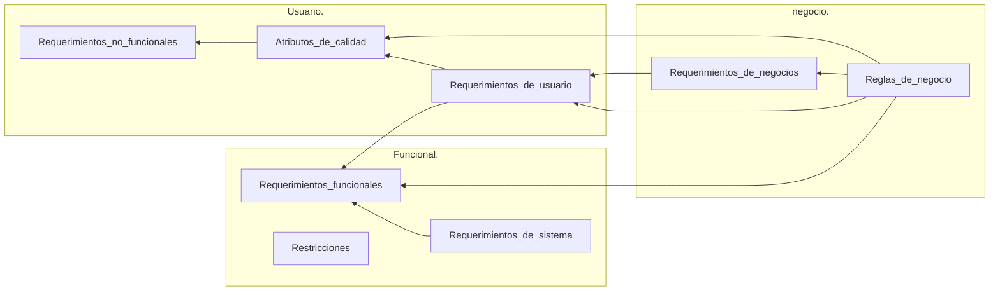

# Fundamentos de Arquitectura de Software.

---

## Etapas del proceso de desarrollo de software.

````mermaid
flowchart LR
Análisis_de_Requerimientos. --> Diseño_de_la_Solución. --> Desarrollo_y_Evaluación. --> Despliegue. --> Mantenimiento_y_Evolución.
````

### Análisis de requerimientos.

Los requerimientos son todas aquellas características y funcionalidades que un producto debe de poseer para poder solucionar una necesidad específica, dando como resultado una comprensión muy clara del producto y de la problemática a resolver.

#### Requerimientos de usuario.

#### Requerimientos de negocio.

#### Requerimientos funcionales.

#### Requerimientos no funcionales.


### Diseño de la solución.

Análisis profundo del problema, y una propuesta de diseño de una solución. Es la propuesta a nivel de diseño de la solución, en donde se plantea y concretan las posibles soluciones tanto en modelo, documentación, alternativas de productos y herramientas y detalles específicos de la solución.

El resultado de esto es un esquema detallado de la solución tanto en documentación, modelado, diseño, etc. 


### Desarrollo y evaluación.

Etapa en la que se desarrolla y construye el software en función de los criterios de aceptación ya especificados.

__Criterios de aceptación de la solución__: Es el set de requerimientos necesarios para construir la solución y la manera en la que se evaluarán. 


### Despliegue.

Se pone a disponibilidad del usuario final la solución construida, todo esto a través de una infraestructura especializada  controlada y mantenida por un equipo de operaciones quienes se aseguran de llevar y mantener el producto en producción, es decir, a disponibilidad del usuario final.


### Mantenimiento y evolución.

Es una etapa donde se regresa continuamente a las etapas previas de desarrollo y evaluación y luego a la de despliegue, ya que consiste en estar continuamente mejorando el producto y atentos a la detección de errores, para poder cambiar el software y colocarlo de nuevo a disponibilidad del usuario, todo esto se repite hasta que el software deje de ser necesario y su ciclo de vida termine.

---


## Dificultades en el desarrollo de software.

[No hay balas de plata - Wikipedia, la enciclopedia libre](https://es.wikipedia.org/wiki/No_hay_balas_de_plata)

[Ensayo — “No Silver Bullet” de Frederick P. Brooks, Jr. | by Jose Alejandro Gómez Castro | Medium](https://josegomezdev.medium.com/ensayo-no-silver-bullet-de-frederick-p-brooks-jr-e11c6884677d)

### Problemas esenciales.

Especificación, diseño y comprobación del concepto.

> Entender el concepto de lo que queremos desarrollar y su diseño.

#### Complejidad.

#### Conformidad.

#### Tolerancias al cambio.

#### Invisibilidad.

### Soluciones esenciales.

#### No desarrollar.

En cambio optar por adquirir una solución ya existente, ya sea privada o de código abierto, o conseguir una herramienta, del tipo que sea, que permita adelantar lo más posible su desarrollo.

#### Prototipado rápido.

Como podrían ser las metodologías ágiles, donde la idea es obtener información lo antes posible sobre si estamos resolviendo el problema correcto y de la forma adecuada, para ello el sistema va evolucionando de forma paulatina y a traves de cambios pequeños en función de las referencias e información aportada por el usuario.

#### Desarrollo evolutivo.

Más alineado a la creación y acumulación de sistemas, donde se intenta obtener resultados pequeños que poco a poco vayan evolucionando, muy alineado tambien con las metodologías agiles. 

#### Grandes diseñadores.

Son desarrolladores que saben como abstraerse del problema específico y entender las generalidades del mismo, sabiendo diseñar una solución elegante y simple al resolver de la mejor forma el problema.


### Problemas accidentales.

Detalles de la implementación y producción actual.

> Plataforma, lenguaje, framework y su integración.

#### Lenguajes de alto nivel.

#### Multiprocesamiento.

#### Entornos de programación.

---


## Objetivos del arquitecto.

El arquitecto tiene varias partes interesadas (o _stakeholders_) las cuales tienen necesidades independientes y especificas, y el papel del arquitecto es poder conectar estos requerimientos con la implementación del sistema.

Las partes interesadas con sus distintos requerimientos son:

- __Cliente:__ Obtener un sistema que se amolde al presupuesto y a los tiempos acordados.
- __Manager:__ Asociado a los requerimientos del cliente, desarrollar el software de manera independiente, formar equipos con capacidad de autogestión y una comunicación clara entre los equipos que participan en el desarrollo del sistema.
- __Desarrolladores:__ Fácil implementación y mantenimiento, caracteristicas dependientes de la flexibilidad y escalabilidad.
- __Usuario:__ Disponibilidad y confiabilidad del sistema.
- __Q.A:__ Fácil testeo y comprobación de calidad.

El arquitecto de software debe gestionar los siguientes requerimientos de para cada parte interesada:

- __Cliente:__ Encontrar los riesgos más altos que afecten en el desarrollo del sistema.
- __Manager:__ Modularización y flecibilidad del sistema que se está desarrollando.
- __Desarrollador:__ Modularidad, mantenibilidad y capacidad de cambio del software.
- __Usuario:__ Decidir estrategias para la dispobibilidad del sistema. 
- __Q.A.:__ Que el sistema pueda ser modularizado y cada una de estas partes pueda ser probada de forma sencilla. Que el sistema pueda responder de forma consistente, que pueda ser modularizado y que dichos módulos puedan ser probados independientemente.

La unión de estos requerimientos, tanto funcionales como no funcionales, va a llevar al arquitecto a tomar decisiones que impactan directamente en el desarrollo del software.

---


## Entender el problema.

Al momento de rocopilar requerimientos y procesarlos, es importante entender el problema que se pretende resolver. La parte más importante es separar la comprensión del problema de la propuesta de solución, ya que al no ser capaces de separar dichos aspectos, se puede caer en el error de percibir ciertas caracteristicas como la plataforma, el framework, la arquitectura general, etc, como parte del problema, cuando en realidad son detalles de implementación.

### Espacio del problema.

#### Idea.

Aquí se plantean preguntas como: ¿Qué es lo que vámos a hacer? ¿Qué es lo que se quiere resolver? ¿Cual es la problemática identificada que podemos solucionar con la implementación de un proyecto de software?

#### Historias de usuario.

Es la historia o la narrativa de como un usuario, a traves de la solución a desarrollar, puede llegar a tener una experiencia que resuelva su problemática. No se habla del sistema sino que se describe el problema que se quiere resolver, detallando esta problemática e intentando describir la solución.

#### Criterios de Éxito.

Luego de entender el problema a resolver y delimitarlo, entendiendo por supuesto su alcance y aquellas otras problemáticas fuera del proyecto y de las intenciones del mismo, se pasa a listar aquellas características o acciones que resolverían las necesidades del usuario.


### Espacio de la solución.

Es un reflejo del espacio del problema, ya que toma en cuenta su narrativa para luego intentar solventarla a través de un planteamiento técnico. 

#### Diseño.

Todo lo referente a la planificación del software, desde el diseño de la interfaz, la experiencia de usuario, hasta el diseño del sistema.

#### Desarrollo.

#### Evaluación.

#### Criterios de aceptación.

Son características que relacionan las funcionalidades del software con las necesidades descritas y demandadas por el usuario. Se describen criterios para coordinar y alinear el proyecto y sus funcionalidades con el usuario y la problemática que este puede poseer y que se pretende solventar.

#### Despliegue.

---


## Requerimientos.

### Requerimientos de producto.



Los __requerimientos de producto__ se separan en tres grupos o capas: __requerimientos de negocio__, __requerimientos de usuario__ y __requerimientos funcionales__.

> __Regla:__  
>
> - Principio o fórmula sobre la manera de hacer una cosa.
> - Conjunto de principios o normas que indican cómo comportarse.
> - Modo de ejercer o de ejecutar una cosa.
>
> __Requerimiento:__
>
> ​	__Requerir:__
>
> -  Pedir una cosa la autoridad.
> - Tener una persona o una cosa necesidad de otra.

- __Negocio:__ Las __reglas de negocio__ son aquellos requerimientos que forman el núcleo o la esencia de la solución, es decir, son todas aquellas funcionalidades y características que le dan forma y sentido a la funcionalidad y que le permiten poder solventar la problemáticas en cuestión.
  Estas __reglas de negocio__ siguen siendo funcionalidades o características inespecíficas que alimentarán a los requerimientos de negocio (y a muchos otros requerimientos del producto) al poder brindarle una descripción general de la solución al problema que luego tendrá que ser concretada en los __requerimientos de negocio__.
  Por ejemplo, una __regla de negocio__ puede ser el poder ofrecerle hospedaje seguro y económico a las personas como alternativa a los costosos hoteles al conectar a los arrendadores con los turistas, y el __requerimiento de negocio__ sería el poder conectar a ambas partes generando diferentes roles de usuario con características bien definidas. 
  Estas __reglas de negocio__ condicionan e interceden en todas las capas del requerimiento de producto, ya que describen las funcionalidades esenciales del producto, la manera en la que se debe de comportar para lograr solventar la necesidad que se tiene identificada.
- __Usuario:__ Los __requerimientos de usuario__ tienen que ver con la manera en la que el usuario se puede desenvolver usando el sistema, estos requerimientos, los de usuario, también tienen que ver con los atributos de calidad, los cuales condicionan a los __requerimientos no funcionales__, ya que determinan la manera en la que el usuario interaccionará con la solución, sus tiempos de espera, las garantías de seguridad (un __atributo de calidad__), recolección de información, etc.
- __Funcional:__ Estos se alimentan de los dos requerimientos previos y su propósito es bajar a tierra, concretar, las funcionalidades, aquí se dejan de lado las historias genéricas, los valores de negocio o las estrategias generales, en este paso hablamos puntualmente de que es lo que hay que hacer en este sistema en concreto para implementar una funcionalidad en concreto.
  Los __requerimientos funcionales__  se alimentan de los __requerimientos de sistema__ en la medida en la que estos describen lo que tiene que pasar operativamente para poder realizar dicho __requerimiento funcional__,
  Los __requerimientos funcionales__ también determinan las restricciones del sistema, como los permisos de acceso de cada tipo de usuario, las restricciones de comunicación, restricciones de conectividad, etc. Todo esto tiene que ver con las restricciones contextuales de los requerimientos.

Los requerimientos de producto se pueden separar en __funcionales__ y __no funcionales__. 

Los __funcionales__ detallan específicamente como el sistema se va a comportar. Los requisitos funcionales establecen los comportamientos propios del software.

Los __no funcionales__ representan características generales y restricciones de la aplicación o sistema a desarrollar, son las expectativas que se tienen de las funcionalidades. Se pueden entender como aquellas características relativas al rendimiento, eficiencia e interacción con el usuario, como podría ser el poder manejar una $n$ cantidad de peticiones, permitir el acceso a los usuarios en un lapso especifico y corto de tiempo o que toda funcionalidad del sistema y transacción responsa en menos de $n$ segundos.


### Requerimientos de proyecto.

Estos requerimientos tienen más que ver con el rol de gestor de proyecto, a pesar de que el arquitecto tiene que estar al tanto de estos requerimientos y poder trabajar en conjunto con el gestor de proyecto para poder entender y priorizar ambos requerimientos, los de proyecto y los de producto, ya que a mbos se condicionan.

De entre todos los requerimientos de proyecto podríamos destacas los siguientes:

- __Recursos.__
- __Capacitación.__
- __Certificaciones.__
- __Documentación de usuario.__
- __Infraestructura.__
- __Licencias.__
- __Plan de despliegue.__
- __Plan de transición.__
- __Acuerdos de servicio.__

Estos requerimientos describen todas aquellas características y recursos que harán falta para poder llevar a cabo el proyecto.

---


## Riesgos.

La implementación de cualquier sistema incurre en riesgos específicos propios de dicho sistema, ya que no existe un sistema o una arquitectura perfecta e infalible, es importante tener en cuenta todos los riesgos en los que se incurren. 

Estos riesgos van a ser importantes para poder priorizarlos y poder solventarlos en orden y que eso nos garantice que las soluciones arquitectónicas que estamos tomando solucionen los problemas más importantes, y no cualquier problema que se cruce en el camino. 

### Describir el riesgo.

Usar escenarios de fracaso que sean medibles y accionables. 

#### Riesgos de ingeniería.

Relacionados con el análisis, diseño e implementación del producto.

#### Riesgos de gestión del proyecto.

Relacionados con la planificación, secuenciamiento de trabajo, entregas, tamaño de equipo, etc.


No es posible cubrir todos los riesgos en un primer momento, por lo que es fundamental tener la capacidad de priorizar los riesgos para poder cubrir aquellos que se consideren más acuciantes y puedan generar mayores daños, ya que el no saber priorizar de manera acertada podría hacer que se solventen riesgos menores dejando al descubiertos potenciales fallos de un mayor nivel. 

En cuanto a priorizar, la ley de Pareto es sumamente útil, ya que generalmente el el 80% de todos los daños sufridos por un sistema vienen del 20% de las vulnerabilidades del mismo.


---


## Restricciones. 

> Una restricción limita las opciones de diseño o implementación disponibles al desarrollo. 

Las restricciones en el contexto de un proceso de desarrollo de software tienen que ver con limitaciones en las opciones que tendremos, tanto de diseño como de implementación. 

El contexto, en general, está dado por las partes interesadas (los ___stakeholders___), los cuales colocan limitaciones relativas a su ecosistema, su contexto de negocio, regulaciones, normas legales, etc. También habrá limitaciones debido a la integración con otros sistemas, ya que esta comunicación condicionará y por consiguiente restringirá ciertas posibles características del desarrollo, como el tipo de protocolo de comunicación o la vía por la que se efectuará la comunicación. Por ultimo está el ciclo de vida del producto, el cual irá gradualmente agregando restricciones a medida que va evolucionando la aplicación, ya que el modelo de datos se va volviendo cada vez más rígido y difícil de cambiar.  

---


## Estilos de arquitectura.

Un estilo de arquitectura es un modelo genérico de estructura en donde no se habla en detalle sobre el problema que resuelve el dominio, sino que hable de que problema se está resolviendo arquitectonicamente a nivel de los conectores entre diferentes aplicaciones, entre dos sistemas, entre usuarios, etc. Todo esto define algo genérico que si nos permite reutilizar, en diferentes softwares, un estilo que nos ayuda a poder reutilizar estos esquemas. 

> Un estilo de arquitectura es una colección de decisiones de diseño, aplicables en un contexto determinado, que restringen las decisiones arquitectónicas específicas en ese contexto y obtienen beneficios en cada sistema resultante.

Los estilos de arquitectura toman los esquemas previos que ya otras soluciones utilizaron en el pasado y describieron como útiles y eficaces y los estandariza y esquematiza en plantillas aprovechables para que otras personas con problemáticas generales similares las puedan aprovechar. 

---


## Llamada y retorno.

  ```mermaid
  flowchart BT
  
  Programa_principal\ny_subrutinas.
  
  Orientado_a_objetos.
  
  Multi-nivel.
  
  Cliente-Servidor --> Multi-nivel
  ```

## Flujo de datos.


