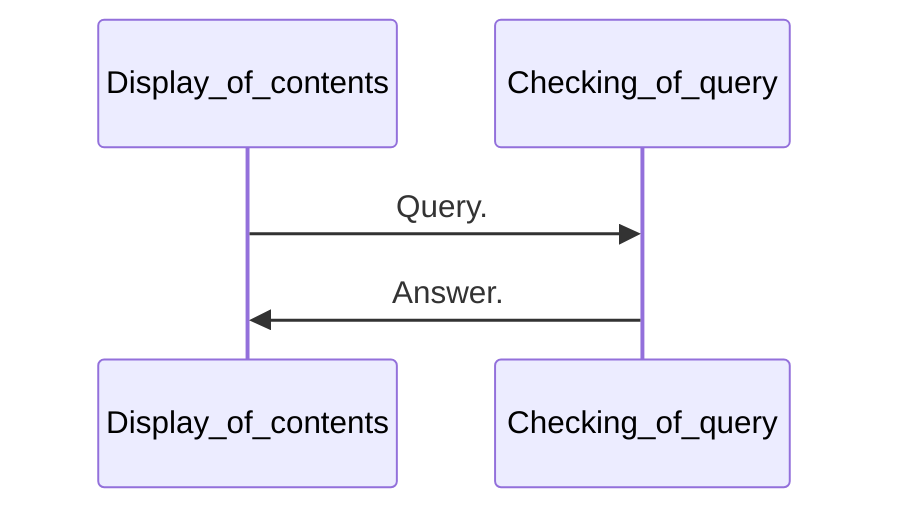

# WebSocket.

__WebSocket__ es un protocolo de red basado en __TCP__ que establece cómo deben intercambiarse datos entre redes. Puesto que es un protocolo fiable y eficiente, es utilizado por prácticamente todos los clientes. El protocolo __TCP__ establece conexiones entre dos puntos fiables de comunicación, llamados __sockets__. De esta manera, el intercambio de datos puede producirse en las dos direcciones. Este sistema es capaz de mantener una comunicación bidireccional, enviando y recibiendo mensajes de forma simultanea (también llamada Dúplex, y en este caso sería un _full_ dúplex.).

> La capacidad de transmitir en modo dúplex está condicionado por varios niveles:
>
> - Medio físico (capaz de transmitir en ambos sentidos).
> - Sistema de transmisión (capaz de enviar y recibir a la vez).
> - Protocolo o norma de comunicación empleado por los equipos terminales.
>
> ---
>
> 

En las conexiones bidireccionales, como las que crea __WebSocket__ permite así una comunicación directa entre una aplicación web y un servidor __WebSocket__. En otras palabras: la web que se muestra en tiempo real.

---

## ¿Cómo funciona?

En Internet, la transmisión de páginas web suele realizarse mediante una conexión __HTTP__. Este protocolo sirve para transmitir datos y hace posible la carga de las páginas web en el navegador. Para lograrlo, el cliente envía, con cada acción del usuario una solicitud al servidor. 

Para acceder a una página web, en __HTTP__, el cliente debe enviar primero una solicitud al servidor. Una vez enviada, el servidor puede responder y mostrar el contenido solicitado. Se trata de un rígido patrón de solicitud y respuesta que provoca, en última instancia, largos tiempos de espera entre la solicitud y la respuesta. 



> Las conexiones __HTTP__ se basan en el clásico esquema de pregunta y respuesta, en el que el cliente debe enviar una solucitud al servidor para que este pueda mostrar el contenido solicitado.

El protocolo __WebSocket__ permite acceder a una web de forma dinámica en tiempo real, bastando con que el cliente establezca una conexión con el servidor, que se confirma mediante el __WebSocket Protocol Hadshake__. Con él, el cliente envía al servidor todos los datos de identificación necesarios para el intercambio de información.

El canal de comunicación se queda abierto tras el __handshake__. El servidor puede activarse por sí mismo y poner toda la información a disposición del cliente, sin que este tenga que pedírselo. Las notificaciones _push_ de las páginas web también funcionan según este principio. Si el servidor dispone de nueva información, se lo comunica al cliente, sin necesidad de recibir una solicitud específica para ello.

Para iniciar el intercambio el cliente envía una solicitud, al igual que en el clásico __HTTP__. Sin embargo, la conexión se establece mediante __TCP__ y permanece abierta tras el ___handshake___ entre cliente y servidor, que tiene la siguiente forma:

El cliente envía la solicitud:

```mixed
GET /chatService HTTP/1.1
Host: server.example.com
Upgrade: websocket
Connection: Upgrade
Sec-WebSocket-Key: dGhlIHNhbXBsZSBub25jZQ==
Sec-WebSocket-Origin: http://example.com
Sec-WebSocket-Protocol: chat, superchat
Sec-WebSocket-Version: 13
```

y el servidor responde:

```mixed
HTTP/1.1 101 Switching Protocols
Upgrade: WebSocket
Connection: Upgrade
Sec-WebSocket-Accept: s3pPLMBiTxaQ9kYGzzhZRbK+xOo=
Sec-WebSocket-Protocol: superchat
```

El nuevo esquema __URL__ de ___WebSocket___ para las páginas web mostradas se define con el prefijo ___ws___ en lugar del ___http___. El prefijo que corresponde a una conexión segura es, entonces ___wss___, de forma análoga a ___https___.

## ¿Para que funciona?

Se utiliza ___WebSocket___ siempre que se pretenda establecer conexiones de forma rápida y fluida. Como puede ser el caso de los chats, de los tickers de noticias, de actualizaciones de bolsa en directo y de los juegos en tiempo real. Los patrones convencionales de solicitud de conexión han dejado de ser útiles para cubrir las necesidades de muchas empresas.

El uso tradicional de las conexiones __HTTP__ tiene el inconveniente de que el cliente siempre carga la página __HTML__ entera. Para resolver el problema, se desarrolló la tecnología __AJAX__. Esta tenía, por su parte, la desventaja de establecer conexiones unidireccionales, es decir, que solo permiten la comunicación en una dirección, lo cual daría lugar a largos tiempos de espera en las intensivas aplicaciones de hoy en día, especialmente en los chats, en cambio, crea conexiones bidireccionales que permiten el intercambio de datos en ambos sentidos, lo cual hace posible el contacto directo con el navegador y, con ello, permite cortos periodos de carga.

## Implementación de ___WebSocket___.

Del lado del servidor, ___WebSocket___ puede implementarse con las siguientes tecnologías:

- Python

  - pyWebSocket
  - Tornado

  

---

[WebSocket | Un canal de comunicación para la web en tiempo real - IONOS](https://www.ionos.es/digitalguide/paginas-web/desarrollo-web/que-es-websocket/)

[WebSocket - Wikipedia, la enciclopedia libre](https://es.wikipedia.org/wiki/WebSocket)